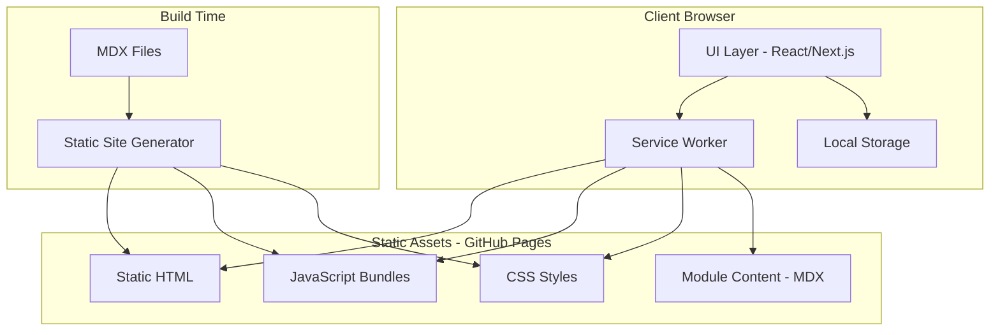
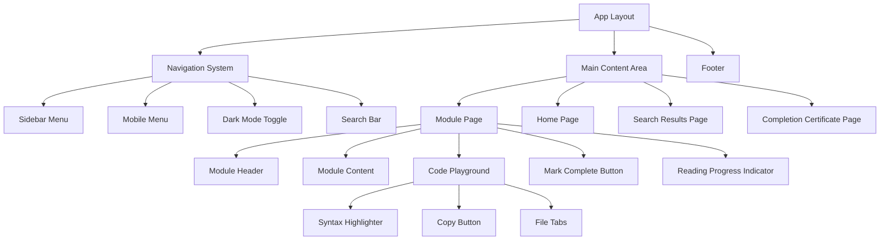

# Design Document: Mobile Programming Learning Website

## Overview

This design document outlines the architecture and implementation details for a static learning website for the "Pemrograman Piranti Bergerak" (Mobile Device Programming) course at Universitas Terbuka. The website will teach Ionic Framework development from beginner to advanced level, deployable to GitHub Pages as a free, publicly accessible educational resource.

The website will be built using modern web technologies optimized for static site generation, featuring interactive code playgrounds, progress tracking via local storage, offline capabilities through service workers, and a responsive dark/light mode interface.

## Architecture

### High-Level Architecture



### Technology Stack

| Layer | Technology | Rationale |
|-------|------------|-----------|
| Framework | Next.js (Static Export) | Excellent static site generation, React ecosystem, MDX support |
| Styling | Tailwind CSS | Utility-first, easy dark mode, responsive design |
| Content | MDX | Markdown with JSX components for interactive code examples |
| Code Highlighting | Prism.js / Shiki | Syntax highlighting for TypeScript, HTML, CSS |
| Search | Fuse.js | Client-side fuzzy search, no server required |
| Offline | Service Worker (Workbox) | PWA capabilities, content caching |
| Deployment | GitHub Pages | Free static hosting, CI/CD via GitHub Actions |

## Components and Interfaces

### Component Hierarchy



### Core Interfaces

```typescript
// Module content structure
interface Module {
  id: string;
  title: string;
  slug: string;
  order: number;
  description: string;
  learningObjectives: string[];
  estimatedTime: number; // in minutes
  content: MDXContent;
  summary: string[];
  nextModule?: string;
  prevModule?: string;
}

// Progress tracking
interface ProgressState {
  completedModules: string[]; // Array of module IDs
  lastVisited: string; // Module ID
  lastUpdated: Date;
}

// Search result
interface SearchResult {
  moduleId: string;
  moduleTitle: string;
  sectionId: string;
  sectionTitle: string;
  excerpt: string;
  matchedKeywords: string[];
  relevanceScore: number;
}

// Search response with suggestions for no-results case (Requirement 8.4)
interface SearchResponse {
  results: SearchResult[];
  suggestions: string[]; // Alternative search terms when no results found
  popularTopics: string[]; // Popular topics to suggest
}

// Code example structure
interface CodeExample {
  id: string;
  files: CodeFile[];
  description?: string;
}

interface CodeFile {
  filename: string;
  language: 'typescript' | 'html' | 'css' | 'json' | 'bash';
  code: string;
  highlightLines?: number[];
}

// Theme state
interface ThemeState {
  mode: 'light' | 'dark';
  systemPreference: boolean;
}

// Offline status
interface OfflineState {
  isOnline: boolean;
  cachedModules: string[];
  lastSyncTime: Date;
}

// Reading progress (scroll position)
interface ReadingProgressState {
  moduleId: string;
  scrollPercentage: number; // 0-100
  currentSection: string;
}

// Completion certificate
interface CompletionCertificate {
  studentName?: string;
  completionDate: Date;
  totalModules: number;
  completedModules: number;
}
```

### Component Specifications

#### NavigationSystem
- Renders persistent sidebar on desktop (>1024px)
- Collapses to hamburger menu on mobile/tablet
- Displays all modules with completion status indicators
- Highlights current active module
- Provides smooth scroll-to-section functionality

#### CodePlayground
- Accepts single or multiple code files
- Renders syntax-highlighted code with line numbers
- Provides copy-to-clipboard functionality with toast notification
- Supports file tabs for multi-file examples
- Responsive width with horizontal scroll for long lines

#### ProgressTracker
- Stores progress in localStorage under key `ionic-learning-progress`
- Provides methods: `markComplete(moduleId)`, `isComplete(moduleId)`, `getProgress()`
- Triggers UI updates via React context/state
- Validates data integrity on load

#### SearchEngine
- Builds search index at build time from all module content
- Performs client-side fuzzy search using Fuse.js
- Returns results with highlighted matching terms
- Debounces search input (300ms)
- Target response time: under 1 second for search results display
- Provides alternative search suggestions when no results found (Requirement 8.4)
- Maintains list of popular topics for fallback suggestions

#### ReadingProgressIndicator
- Displays current scroll position as percentage bar at top of module page
- Updates in real-time as user scrolls through content
- Shows current section name based on visible headings
- Lightweight implementation using Intersection Observer API for performance

#### CompletionCertificatePage
- Displays congratulatory message when all modules are completed
- Shows completion statistics (total modules, completion date)
- Optionally allows student to enter name for personalized certificate
- Provides shareable/printable certificate view

#### AnimationSystem
- Provides smooth page transitions using CSS transitions (200-300ms duration)
- Implements hover states with subtle scale/color transitions
- Uses CSS `prefers-reduced-motion` media query for accessibility
- Toast notifications animate in/out smoothly
- Button interactions provide immediate visual feedback (ripple effect or scale)

## Data Models

### Module Content Schema (MDX Frontmatter)

```yaml
---
id: "module-01"
title: "Pengenalan Ionic Framework"
order: 1
description: "Memahami dasar-dasar pengembangan aplikasi mobile dengan Ionic"
learningObjectives:
  - "Memahami konsep hybrid mobile development"
  - "Mengenal arsitektur Ionic Framework"
  - "Menyiapkan environment development"
estimatedTime: 45
---
```

### Progress Data (localStorage)

```typescript
// Key: 'ionic-learning-progress'
interface StoredProgress {
  version: 1;
  completedModules: string[];
  lastVisited: string;
  lastUpdated: string; // ISO date string
  allCompleted: boolean; // Flag for completion certificate trigger
  completionDate?: string; // ISO date string when all modules completed
}
```

### Typography Configuration

```typescript
// Typography settings for readability (Requirement 5.3)
interface TypographyConfig {
  baseFontSize: '16px' | '18px'; // Minimum 16px for body text
  lineHeight: 1.6 | 1.7 | 1.8; // Comfortable reading line height
  paragraphSpacing: '1rem' | '1.5rem';
  headingScale: number[]; // [h1, h2, h3, h4] multipliers
  fontFamily: {
    body: string; // System font stack or readable sans-serif
    code: string; // Monospace font for code blocks
  };
}

// Default typography values
const defaultTypography: TypographyConfig = {
  baseFontSize: '18px',
  lineHeight: 1.7,
  paragraphSpacing: '1.5rem',
  headingScale: [2.5, 2, 1.5, 1.25],
  fontFamily: {
    body: 'system-ui, -apple-system, sans-serif',
    code: 'ui-monospace, "Fira Code", monospace'
  }
};
```

### Search Index Schema

```typescript
interface SearchIndexEntry {
  moduleId: string;
  moduleTitle: string;
  sectionId: string;
  sectionTitle: string;
  content: string; // Plain text content for searching
  keywords: string[];
}
```

### Curriculum Structure

```
modules/
├── 01-introduction/
│   └── index.mdx          # Pengenalan Mobile Development & Ionic
├── 02-environment-setup/
│   └── index.mdx          # Setup Node.js, Ionic CLI, VS Code
├── 03-ionic-basics/
│   └── index.mdx          # Project structure, pages, components
├── 04-ui-components/
│   └── index.mdx          # Ionic UI components library
├── 05-navigation/
│   └── index.mdx          # Routing, tabs, side menu
├── 06-forms/
│   └── index.mdx          # Form handling, validation
├── 07-http-data/
│   └── index.mdx          # HTTP requests, API integration
├── 08-native-features/
│   └── index.mdx          # Camera, geolocation, storage
├── 09-state-management/
│   └── index.mdx          # State patterns, services
├── 10-deployment/
│   └── index.mdx          # Build, deploy to app stores
└── 11-final-project/
    └── index.mdx          # Complete app step-by-step tutorial (Requirement 6.4)
```

### Project Tutorial Structure (Requirement 6.4)

The final project module (Module 11) provides step-by-step project tutorials for building complete applications:

```typescript
interface ProjectTutorial {
  id: string;
  title: string;
  description: string;
  difficulty: 'beginner' | 'intermediate' | 'advanced';
  estimatedTime: number; // in minutes
  steps: TutorialStep[];
  finalCode: CodeExample;
}

interface TutorialStep {
  stepNumber: number;
  title: string;
  description: string;
  codeChanges: CodeExample[];
  explanation: string;
  checkpoint?: string; // What the app should do at this point
}
```


## Correctness Properties

*A property is a characteristic or behavior that should hold true across all valid executions of a system-essentially, a formal statement about what the system should do. Properties serve as the bridge between human-readable specifications and machine-verifiable correctness guarantees.*

Based on the acceptance criteria analysis, the following correctness properties must be validated through property-based testing:

### Property 1: Module ordering consistency
*For any* collection of modules, when sorted by their order property, the resulting sequence SHALL present content in progressive difficulty from basic (lower order) to advanced (higher order) topics.
**Validates: Requirements 2.2**

### Property 2: Module structure - learning objectives
*For any* module in the curriculum, the module SHALL contain a non-empty array of learning objectives that are displayed at the beginning of the module content.
**Validates: Requirements 2.3**

### Property 3: Module structure - summary
*For any* module in the curriculum, the module SHALL contain a non-empty summary array of key concepts covered.
**Validates: Requirements 2.4**

### Property 4: Syntax highlighting output validity
*For any* code string and supported language (TypeScript, HTML, CSS), the syntax highlighter SHALL produce valid HTML output containing appropriate syntax tokens.
**Validates: Requirements 3.1**

### Property 5: Code display - line numbers
*For any* code example rendered in the Code_Playground, the output SHALL include line numbers corresponding to each line of the source code.
**Validates: Requirements 3.3**

### Property 6: Multi-file code display - file labels
*For any* code example containing multiple files, each file SHALL be displayed with its filename as a visible label.
**Validates: Requirements 3.4**

### Property 7: Progress persistence round-trip
*For any* module ID, marking it as complete and then reading from storage SHALL return that module in the completed modules list. Additionally, saving progress and restoring it SHALL produce equivalent progress state.
**Validates: Requirements 4.1, 4.2**

### Property 8: Progress indicator accuracy
*For any* progress state containing completed module IDs, the module list display SHALL show correct visual indicators (completed vs incomplete) matching the stored state.
**Validates: Requirements 4.3**

### Property 9: Dark mode toggle round-trip
*For any* initial theme state, toggling dark mode twice SHALL return the theme to its original state.
**Validates: Requirements 5.1**

### Property 10: Module content completeness
*For any* module in the curriculum, the module SHALL contain both theoretical explanation text and at least one practical code example.
**Validates: Requirements 6.2**

### Property 11: Module external resources
*For any* module in the curriculum, the module SHALL contain at least one link to official Ionic documentation or related external references.
**Validates: Requirements 6.3**

### Property 12: Offline content caching round-trip
*For any* module that has been loaded while online, caching the content and then accessing it while offline SHALL return the same content.
**Validates: Requirements 7.1, 7.2**

### Property 13: Offline status indicator accuracy
*For any* network state (online/offline), the offline indicator SHALL correctly reflect the current connection status.
**Validates: Requirements 7.3**

### Property 14: Search relevance
*For any* search query and module content, the search results SHALL only include modules that contain the search terms, ordered by relevance score.
**Validates: Requirements 8.1**

### Property 15: Search keyword highlighting
*For any* search result, all instances of the matched search keywords SHALL be highlighted in the result excerpt.
**Validates: Requirements 8.2**

### Property 20: Search no-results suggestions
*For any* search query that returns zero results, the search system SHALL return a non-empty array of suggested alternative terms or popular topics.
**Validates: Requirements 8.4**

### Property 16: Reading progress indicator accuracy
*For any* scroll position within a module page, the reading progress indicator SHALL display a percentage value between 0 and 100 that accurately reflects the user's position relative to total scrollable content.
**Validates: Requirements 1.4**

### Property 17: Completion certificate trigger
*For any* progress state where all module IDs are marked as completed, the system SHALL display a completion certificate or congratulation message.
**Validates: Requirements 4.4**

### Property 18: Navigation response time
*For any* module navigation action, the target module page SHALL begin rendering within 2 seconds of the user click event.
**Validates: Requirements 1.2**

### Property 19: Animation accessibility
*For any* user with `prefers-reduced-motion: reduce` system setting, all non-essential animations SHALL be disabled or minimized.
**Validates: Requirements 5.4**

## Design Decisions and Rationale

| Decision | Rationale |
|----------|-----------|
| **Next.js Static Export** | Enables GitHub Pages deployment while providing React ecosystem benefits, MDX support, and excellent build-time optimization |
| **Intersection Observer for Reading Progress** | More performant than scroll event listeners; native browser API with good support |
| **localStorage for Progress** | No server required; data persists across sessions; works offline; simple implementation |
| **Fuse.js for Search** | Client-side fuzzy search eliminates server dependency; fast enough for educational content volume |
| **CSS Transitions over JS Animations** | Better performance; respects `prefers-reduced-motion` automatically; simpler implementation |
| **Workbox for Service Worker** | Battle-tested PWA library; handles caching strategies; simplifies offline implementation |
| **fast-check for Property Testing** | Most mature JavaScript PBT library; excellent shrinking; good TypeScript support |
| **Completion Certificate as Page** | Provides shareable URL; can be printed; celebrates student achievement |
| **18px Base Font Size** | Research-backed readability for extended reading; accessible for various vision levels |

## Error Handling

### Client-Side Error Handling

| Error Type | Handling Strategy |
|------------|-------------------|
| localStorage unavailable | Graceful degradation - progress tracking disabled with user notification |
| Service Worker registration failure | Continue without offline support, log warning |
| Search index load failure | Display error message, provide manual navigation |
| Invalid module data | Skip invalid module, log error, continue rendering valid modules |
| Code copy failure | Show error toast, provide manual selection fallback |
| Network offline | Show offline indicator, serve cached content |

### Data Validation

```typescript
// Progress data validation
function validateProgressData(data: unknown): StoredProgress | null {
  if (!data || typeof data !== 'object') return null;
  const obj = data as Record<string, unknown>;
  
  if (obj.version !== 1) return null;
  if (!Array.isArray(obj.completedModules)) return null;
  if (typeof obj.lastVisited !== 'string') return null;
  if (typeof obj.lastUpdated !== 'string') return null;
  
  // Validate all module IDs exist
  const validModuleIds = getModuleIds();
  const validCompleted = obj.completedModules.filter(
    (id): id is string => typeof id === 'string' && validModuleIds.includes(id)
  );
  
  return {
    version: 1,
    completedModules: validCompleted,
    lastVisited: validModuleIds.includes(obj.lastVisited) ? obj.lastVisited : '',
    lastUpdated: obj.lastUpdated
  };
}
```

### Error Boundaries

React error boundaries will be implemented at:
- App level (catch-all)
- Module content level (isolate content rendering errors)
- Code playground level (isolate syntax highlighting errors)

## Testing Strategy

### Testing Framework

- **Unit Testing**: Vitest (fast, Vite-native, Jest-compatible API)
- **Property-Based Testing**: fast-check (JavaScript PBT library)
- **Component Testing**: React Testing Library
- **E2E Testing**: Playwright (optional, for critical user flows)

### Unit Tests

Unit tests will cover:
- Module data parsing and validation
- Progress tracker localStorage operations
- Search index building and querying
- Theme toggle state management
- Code copy functionality
- Utility functions

### Property-Based Tests

Each correctness property (1-15) will be implemented as a property-based test using fast-check:

```typescript
// Example: Property 7 - Progress persistence round-trip
import { fc } from 'fast-check';

// **Feature: mobile-programming-learning-website, Property 7: Progress persistence round-trip**
test('marking module complete persists and restores correctly', () => {
  fc.assert(
    fc.property(
      fc.stringOf(fc.alphanumeric(), { minLength: 1, maxLength: 20 }),
      (moduleId) => {
        // Arrange
        clearProgress();
        
        // Act
        markModuleComplete(moduleId);
        const restored = getProgress();
        
        // Assert
        return restored.completedModules.includes(moduleId);
      }
    ),
    { numRuns: 100 }
  );
});
```

### Test Organization

```
src/
├── __tests__/
│   ├── unit/
│   │   ├── progress-tracker.test.ts
│   │   ├── search-engine.test.ts
│   │   ├── theme-manager.test.ts
│   │   ├── module-parser.test.ts
│   │   ├── reading-progress.test.ts
│   │   └── completion-certificate.test.ts
│   ├── properties/
│   │   ├── module-structure.property.test.ts
│   │   ├── progress-persistence.property.test.ts
│   │   ├── search-relevance.property.test.ts
│   │   ├── search-suggestions.property.test.ts
│   │   ├── code-display.property.test.ts
│   │   ├── theme-toggle.property.test.ts
│   │   ├── reading-progress.property.test.ts
│   │   ├── completion-trigger.property.test.ts
│   │   └── animation-accessibility.property.test.ts
│   └── components/
│       ├── CodePlayground.test.tsx
│       ├── Navigation.test.tsx
│       ├── ProgressIndicator.test.tsx
│       ├── ReadingProgressBar.test.tsx
│       └── CompletionCertificate.test.tsx
```

### Test Configuration

```typescript
// vitest.config.ts
export default defineConfig({
  test: {
    environment: 'jsdom',
    globals: true,
    setupFiles: ['./src/__tests__/setup.ts'],
    coverage: {
      provider: 'v8',
      reporter: ['text', 'html'],
      exclude: ['node_modules/', '**/*.test.ts']
    }
  }
});
```

### Property Test Requirements

- Each property-based test MUST run a minimum of 100 iterations
- Each property-based test MUST be tagged with the format: `**Feature: mobile-programming-learning-website, Property {number}: {property_text}**`
- Property tests MUST use smart generators that constrain inputs to valid domain values
- Property tests MUST NOT use mocks for core logic being tested
